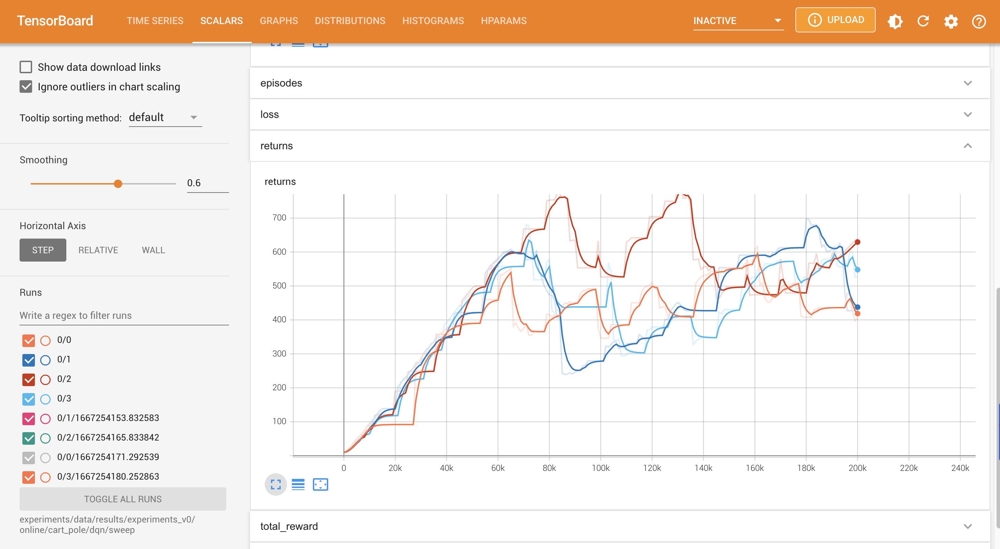

<!-- Improved compatibility of back to top link: See: https://github.com/othneildrew/Best-README-Template/pull/73 -->
<a name="readme-top"></a>
<!--
*** Thanks for checking out the Best-README-Template. If you have a suggestion
*** that would make this better, please fork the repo and create a pull request
*** or simply open an issue with the tag "enhancement".
*** Don't forget to give the project a star!
*** Thanks again! Now go create something AMAZING! :D
-->


<!-- PROJECT SHIELDS -->
<!--
*** I'm using markdown "reference style" links for readability.
*** Reference links are enclosed in brackets [ ] instead of parentheses ( ).
*** See the bottom of this document for the declaration of the reference variables
*** for contributors-url, forks-url, etc. This is an optional, concise syntax you may use.
*** https://www.markdownguide.org/basic-syntax/#reference-style-links
-->
<!-- [![Contributors][contributors-shield]][contributors-url]
[![Forks][forks-shield]][forks-url]
[![Stargazers][stars-shield]][stars-url]
[![Issues][issues-shield]][issues-url]
[![MIT License][license-shield]][license-url]
[![LinkedIn][linkedin-shield]][linkedin-url] -->


<!-- PROJECT LOGO -->
<br />
<div align="center">
  <a href="">
    
  </a>

  <h3 align="center">Base Reinforcement Learning</h3>

  <p align="center">
    A Reinforcement Learning project starter, designed for fast extension, experimentation, and analysis.
    <br />
    <!-- <a href="https://github.com/othneildrew/Best-README-Template"><strong>Explore the docs »</strong></a>
    <br />
    <br />
    <a href="https://github.com/othneildrew/Best-README-Template">View Demo</a> -->
    <!-- · -->
    <a href="https://github.com/erfanMhi/base_reinforcement_learning/issues">Report Bug</a>
    ·
    <a href="https://github.com/erfanMhi/base_reinforcement_learning/issues">Request Feature</a>
  </p>
</div>


<!-- TABLE OF CONTENTS -->
<details>
  <summary>Table of Contents</summary>
  <ol>
    <li>
      <a href="#about-the-project">About The Project</a>
    </li>
    <li>
      <a href="#getting-started">Getting Started</a>
      <ul>
        <li><a href="#prerequisites">Prerequisites</a></li>
        <li><a href="#installation">Installation</a></li>
      </ul>
    </li>
    <li><a href="#quick-start">Quick Start</a></li>
    <li><a href="#usage">Usage</a></li>
    <li><a href="#roadmap">Roadmap</a></li>
    <li><a href="#contributing">Contributing</a></li>
    <li><a href="#license">License</a></li>
    <li><a href="#contact">Contact</a></li>
  </ol>
</details>


<!-- ABOUT THE PROJECT -->
## About The Project
-----------------
<!-- [![Product Name Screen Shot][product-screenshot]](https://example.com) -->

There are many great Reinforcement Learning frameworks on GitHub. However, it is usually challenging to figure out how they can be extended for various purposes that come up in research. Keeping this in mind, this project has been developing by the following features in mind:
* highly readable code and documentation that makes it easier to understand and extend different the project for various purposes
* enables fast experimentation: it shouldn't take you more than 5 minutes to submit an experiment idea, no matter how big it is!
* enables fast analysis: all the info necessary for anlaysing the experiments or debugging them should be readily avaiable to you!
* help me improve my software engineering skills and understand reinforcement learning algorithms to a greater extent
As Richard Feynman said: "What I cannot create, I do not understand."

All of this contributes to a single idea: you shouldn't spend too much time writing ''duplicated code'', instead you should be focused on generating ideas and evaluating them as fast as possible.

<!-- GETTING STARTED -->
## Getting Started
-------------
This section gets you through the requirements and installation of this library.
### Prerequisites
  All the prerequisites of this library are outlined in [setup.cfg](https://github.com/erfanMhi/base_reinforcement_learning/blob/aa3de372d37ccdec45b471b86022e408a58ad81d/setup.cfg) file.
### Installation

To set up your project, you should follow these steps:
1. Clone the project from GitHub:
    ```sh
    git clone https://github.com/erfanMhi/base_reinforcement_learning
    ```
2. Navigate to the root directory:
    ```sh
    cd base_reinforcement_learning
    ```
3. Use pip to install all the dependencies (recommend setting up a new VirtualEnv for this repo)
    ```sh
    pip install .
    ```
4. To make sure that the installation is complete and the library works properly run the tests using
    ```sh
    pytest test
    ```

## Quick Start
----------------------------
You can run a set of dqn experiments on CartPole environment by running:
```sh
python main.py --config-file experiments/data/configs/experiments_v0/online/cart_pole/dqn/sweep.yaml --verbose debug --workers 4
```
This experiment will tune the ``batch-size`` and ``memory_size`` of the replay buffer specified in the config file and returns the most performant parameters. It speeds up the experiments by using 4 parallel processes. The most performant parameters are stored in ``experiments/data/results/experiments_v0/online/cart_pole/dqn/sweep`` directory. 

You can now easily analyze the experiments in tensorboard by running the following command:
```sh
tensorboard --log-dir experiments/data/results/experiments_v0/online/cart_pole/dqn/sweep
```
Doing so enables you to quickly analyse many parameters including, but not limited to:
1. The learning curve of each algorithms. 
<div align=center>
    
</div>
2. The ditribution of weights in each layer has changed over time:
<div align=center>
    
</div>
3. All the details of the neural architecture and the flow of information through it:
<div align=center>
    
</div>
4. Comparison of the performance of the algorithms based on different parameters:
<div align=center>
    
</div>


## Usage
------------------------
To run experiments on this project, you only need to call ``main.py`` with the proper arguments:
  ```text
  python main.py main.py [-h] --config-file CONFIG_FILE [--gpu] --verbose VERBOSE [--workers WORKERS] [--run RUN]

  The main file for running experiments

  optional arguments:
    -h, --help            show this help message and exit
    --config-file CONFIG_FILE
                          Expect a json file describing the fixed and sweeping parameters
    --gpu                 Use GPU: if not specified, use CPU (Multi-GPU is not supported in this version)
    --verbose VERBOSE     Logging level: info or debug
    --workers WORKERS     Number of workers used to run the experiments. -1 means that the number of runs are going to be automatically determined
    --run RUN             Number of times that each algorithm needs to be evaluated
  ```
`--gpu`, ``--run``, and ``--workers`` arguments don't require much explanation. I am going to throughly introduce the function of the remaining arguments.
### Config-file
Let's breakdown `--config-file` argument first. `--config-file` requires you to specify the relative/absolute address of a config file. This config file can be in any data-interchange format. Currently, ``yaml`` files are only supported, but adding other formats like ``json`` is tirivial. An example of one of these config files are provided below:
  ```yaml
  config_class: DQNConfig

  meta-params:
      log_dir: 'experiments/data/results/experiments_v0/online/cart_pole/dqn/best'
      algo_class: OnlineAlgo
      agent_class: DQNAgent
      env_class: CartPoleEnv

  algo-params:

      discount: 0.99

      exploration:
          name: epsilon-greedy
          epsilon: 0.1

      model:
          name: fully-connected
          hidden_layers: 
                    grid-search: # searches through different number of layers and layer sizes for the fully-connected layer
                            - [16, 16, 16]
                            - [32, 32]
                            - [64, 64]
          activation: relu

      target_net:
          name: discrete
          update_frequency: 32

      optimizer: 
          name: adam
          lr:
            uniform-search: [0.0001, 0.001, 8] # searches over 8 random values between 0.0001 and 0.001 
      loss:
          name: mse

      # replay buffer parameters
      memory_size: 2500
      batch_size: 16

      # training parameters
      update_per_step: 1
      max_steps: 100000
  
      # logging parameters
      log_interval: 1000
      returns_queue_size: 100 # used to generate the learning curve and area under the curve of the reinforcement learning technique
  ```
In this file you specify the environment, the agent, and the algorithm you want to use to model the interaction between agent and the environment, along with their parameters. To tune the parameters, you can use different key-words such as ``uniform_search`` and ``grid_search`` which specify the search space of the `Tuner` class. Currently, `Tuner` class only supports the grid-search and random-search, however this class can be instantiated and is able to support much more operations. You almost have control over all of different parameters of your algorithm in this config file.

### Verbose
Experiments can be run in two verbosity modes: ``info`` and ``debug``. In the former, the process will only record the logs required to analyse the performance of the algorithm, such as the learning curve and the area under the curve. In the latter, all sorts of different values that can help us debug the algorithm will be logged, such as the histogram of weights in different layers of networks, the loss values in each step, the graph of the neural network to help us find the architectural bugs, etc. 


<!-- _For more examples, please refer to the [Documentation](https://example.com)_ -->

<p align="right">(<a href="#readme-top">back to top</a>)</p>


<!-- ROADMAP -->
## Roadmap
------------------------
- [x] Implementing and testing initial version of the code
- [ ] Hardware Capability
  - [x] multi-cpu execution
  - [ ] multi-gpu execution
- [ ] Add value-based algorithms:
  - [x] DQN implemented and tested
  - [ ] DDQN
- [ ] Refactoring the code
  - [ ] Factory methods for Optimizers, Loss functions, Networks
  - [ ] Factory method for environments (requires slight changes of the configuration system)
- [ ] Add run aggregator for enabling tensorboard to aggregate the results of multiple runs
- [ ] Add RL algorithms for prediction:
    - [ ] TD(0) with General Value Functions (GVF)
- [ ] Implement OfflineAlgorithm class
- [ ] Implement Policy Gradient Algorithms
  - [ ] Vanila Policy Gradient
  - [ ] Vanila Actor-Critic
  - [ ] PPO
- [ ] Reconfiguring the config files using Dependency Injection approach (most likely using [Hydra](https://hydra.cc/docs/intro/))

See the [open issues](https://github.com/erfanMhi/base_reinforcement_learning/issues) for a full list of proposed features (and known issues).

<p align="right">(<a href="#readme-top">back to top</a>)</p>


<!-- CONTRIBUTING -->
<!-- ## Contributing

For contributing this project 
Contributions are what make the open source community such an amazing place to learn, inspire, and create. Any contributions you make are **greatly appreciated**.

If you have a suggestion that would make this better, please fork the repo and create a pull request. You can also simply open an issue with the tag "enhancement".
Don't forget to give the project a star! Thanks again!

1. Fork the Project
2. Create your Feature Branch (`git checkout -b feature/AmazingFeature`)
3. Commit your Changes (`git commit -m 'Add some AmazingFeature'`)
4. Push to the Branch (`git push origin feature/AmazingFeature`)
5. Open a Pull Request

<p align="right">(<a href="#readme-top">back to top</a>)</p> -->


<!-- LICENSE -->
## License

Distributed under the MIT License. See [LICENSE.rst](https://github.com/erfanMhi/base_reinforcement_learning/LICENSE.rst) for more information.

<p align="right">(<a href="#readme-top">back to top</a>)</p>


<!-- CONTACT -->
## Contact

Erfan Miahi - [@your_twitter](https://twitter.com/erfan_mhi) - mhi.erfan1@gmail.com

Project Link: [https://github.com/erfanMhi/base_reinforcement_learning](https://github.com/erfanMhi/base_reinforcement_learning)

<p align="right">(<a href="#readme-top">back to top</a>)</p>


<!-- ACKNOWLEDGMENTS -->
<!-- ## Acknowledgments

Use this space to list resources you find helpful and would like to give credit to. I've included a few of my favorites to kick things off!

* [Choose an Open Source License](https://choosealicense.com)
* [GitHub Emoji Cheat Sheet](https://www.webpagefx.com/tools/emoji-cheat-sheet)
* [Malven's Flexbox Cheatsheet](https://flexbox.malven.co/)
* [Malven's Grid Cheatsheet](https://grid.malven.co/)
* [Img Shields](https://shields.io)
* [GitHub Pages](https://pages.github.com)
* [Font Awesome](https://fontawesome.com)
* [React Icons](https://react-icons.github.io/react-icons/search)

<p align="right">(<a href="#readme-top">back to top</a>)</p> -->


<!-- MARKDOWN LINKS & IMAGES -->
<!-- https://www.markdownguide.org/basic-syntax/#reference-style-links -->
[contributors-shield]: https://img.shields.io/github/contributors/othneildrew/Best-README-Template.svg?style=for-the-badge
[contributors-url]: https://github.com/othneildrew/Best-README-Template/graphs/contributors
[forks-shield]: https://img.shields.io/github/forks/othneildrew/Best-README-Template.svg?style=for-the-badge
[forks-url]: https://github.com/othneildrew/Best-README-Template/network/members
[stars-shield]: https://img.shields.io/github/stars/othneildrew/Best-README-Template.svg?style=for-the-badge
[stars-url]: https://github.com/othneildrew/Best-README-Template/stargazers
[issues-shield]: https://img.shields.io/github/issues/othneildrew/Best-README-Template.svg?style=for-the-badge
[issues-url]: https://github.com/othneildrew/Best-README-Template/issues
[license-shield]: https://img.shields.io/github/license/othneildrew/Best-README-Template.svg?style=for-the-badge
[license-url]: https://github.com/othneildrew/Best-README-Template/blob/master/LICENSE.txt
[linkedin-shield]: https://img.shields.io/badge/-LinkedIn-black.svg?style=for-the-badge&logo=linkedin&colorB=555
[linkedin-url]: https://linkedin.com/in/othneildrew
[product-screenshot]: images/screenshot.png
[Next.js]: https://img.shields.io/badge/next.js-000000?style=for-the-badge&logo=nextdotjs&logoColor=white
[Next-url]: https://nextjs.org/
[React.js]: https://img.shields.io/badge/React-20232A?style=for-the-badge&logo=react&logoColor=61DAFB
[React-url]: https://reactjs.org/
[Vue.js]: https://img.shields.io/badge/Vue.js-35495E?style=for-the-badge&logo=vuedotjs&logoColor=4FC08D
[Vue-url]: https://vuejs.org/
[Angular.io]: https://img.shields.io/badge/Angular-DD0031?style=for-the-badge&logo=angular&logoColor=white
[Angular-url]: https://angular.io/
[Svelte.dev]: https://img.shields.io/badge/Svelte-4A4A55?style=for-the-badge&logo=svelte&logoColor=FF3E00
[Svelte-url]: https://svelte.dev/
[Laravel.com]: https://img.shields.io/badge/Laravel-FF2D20?style=for-the-badge&logo=laravel&logoColor=white
[Laravel-url]: https://laravel.com
[Bootstrap.com]: https://img.shields.io/badge/Bootstrap-563D7C?style=for-the-badge&logo=bootstrap&logoColor=white
[Bootstrap-url]: https://getbootstrap.com
[JQuery.com]: https://img.shields.io/badge/jQuery-0769AD?style=for-the-badge&logo=jquery&logoColor=white
[JQuery-url]: https://jquery.com 
